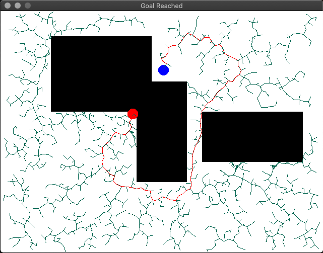

# Path_Planning
### This repository contains the sampling based motion planning algorithms like RRT(Rapidly exploring Random Tree) and PRM(Probabilistic Roadmap) in 2D configuration space with pygame.

These algorithms are part of my project at HTIC, IIT-Madras during my research internship.

We tried a variety of algorithms like RRT, A-star, Dijkstra's, PRM etc in 2D space. RRT among them proves to be the most promising candidate for efficient motion planning in 2D as well as 3D space. 

These algorithms have a variety of applications ranging from protein folding to collision avoidance of mars rover.    

 
<b> Developers: </b> Adwait P Naik  
<b> Guide: </b> Mr. Shyam A, Robotics Engineer, HTIC, IIT-Madras 
<b> Project: <b> Motion Planning for UR5 robotic Arm 
<b> Duration: <b> November 2019 - February 2020  

## Problem Statement

To determine a collision free path in Kinodynamic environment provided the obstacles are static.

## Goal

During accuracy testing & TCP calibration we observed that the our UR5 robot after collision with the table or the mount stopped with a backslash. The trajectories were not smooth at all which affected the accuracy. So we tested a few algorithms to

1) have a smooth trajectory
2) accurate obstacle avoidance and
3) be memory efficient and computationally cheap.

# Libraries used

<ul>
<li> <b> for animation</b> - Pygame</li>
<li> <b> for calculations</b> - numpy, itertools etc<li>
</ul>

# Running requirements

<ul>
<li> Python 3.7 </li>
<li> Pygame and Tkinter </li>
</ul>

## Results
### RRT
<ul>
<b> Rapidly-exploring Random Tree </b>
<li>Implemented a basic RRT algorithm using the pygame library in python</li>
<li> <b>Observations -</b> RRT is an asymptotically optimal algorithm. In other words, it obtains a solution path when the number of iterations tend to infinity. It's probabilistically complete which means that if the path exists it will return it.</li>

<li> <b>disadvantages - </b> In RRT, each time the graph is constructed from scratch which makes it inefficient for finding paths in larger space.
<li> Space complexity of RRT is O(n). In other words it has a linear space complexity which means that if the search space increases the iterations to find an optimal path will also increase subsequently. </li>
</ul>

### RRT-star
<ul>
<b> Rapidly-exploring Random Tree </b>
<li> Implemented RRT-star algorithm using pygame. </li>
<li> RRT* unlike RRT has a slightly different strategy for finding the nearest node which makes it computationally more efficient than RRT.<li>
<li> RRT* takes less iterations to find the optimal path as compares to RRT.</li>RRT* is also asymptotically optimal like RRT.</li>

</ul>

